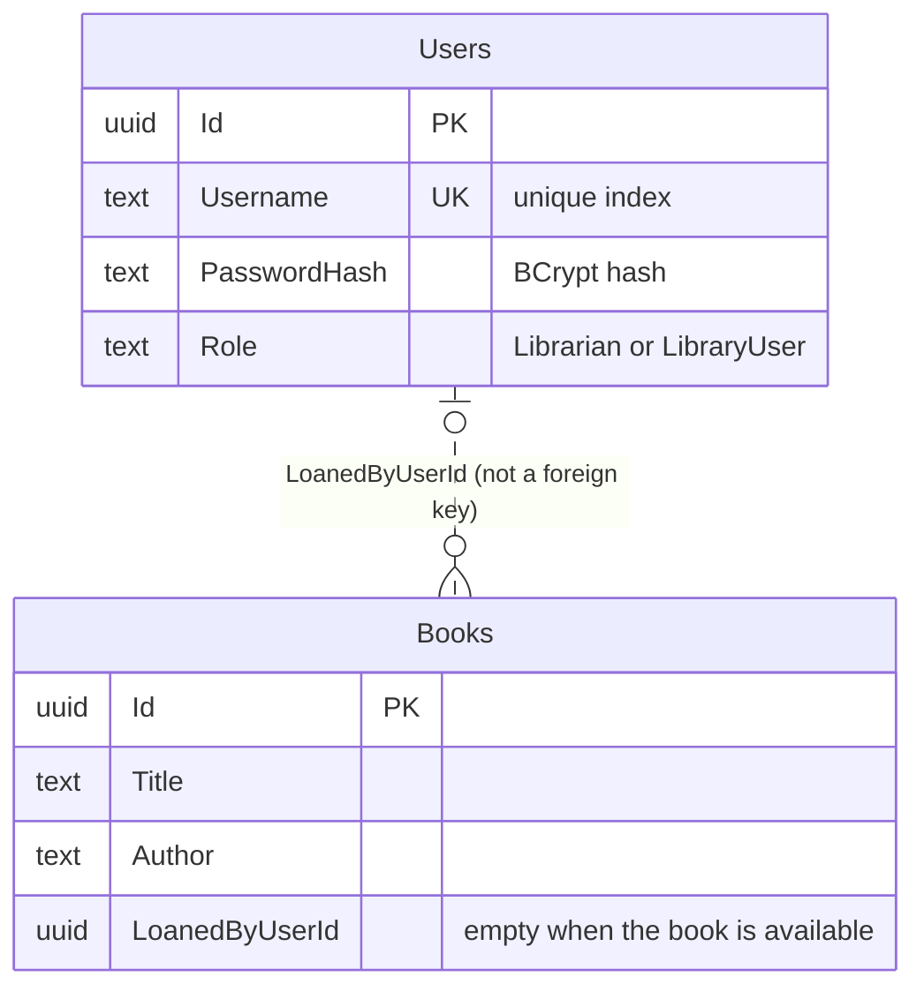

# Data

The two tables in PostgreSQL, from the EF Core migrations. The dotted line means Books.LoanedByUserId points to a user, but the database does not enforce it.

```mermaid
erDiagram
    Users |o..o{ Books : "LoanedByUserId (not a foreign key)"
    Users {
        uuid Id PK
        text Username UK "unique index"
        text PasswordHash "BCrypt hash"
        text Role "Librarian or LibraryUser"
    }
    Books {
        uuid Id PK
        text Title
        text Author
        uuid LoanedByUserId "empty when the book is available"
    }
```
