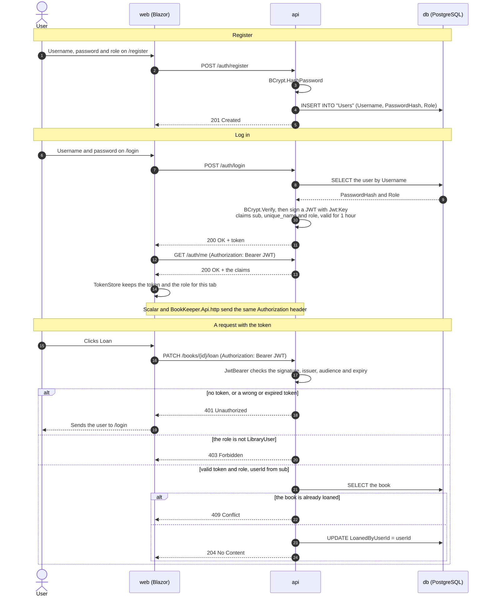

# Login and token

How a user is identified: the password is hashed with BCrypt, login returns a JWT signed with Jwt:Key, and every later request carries it in the Authorization header.

```mermaid
sequenceDiagram
    autonumber
    actor user as User
    participant web as web (Blazor)
    participant api as api
    participant db as db (PostgreSQL)

    Note over user,db: Register
    user->>web: Username, password and role on /register
    web->>api: POST /auth/register
    api->>api: BCrypt.HashPassword
    api->>db: INSERT INTO "Users" (Username, PasswordHash, Role)
    api-->>web: 201 Created

    Note over user,db: Log in
    user->>web: Username and password on /login
    web->>api: POST /auth/login
    api->>db: SELECT the user by Username
    db-->>api: PasswordHash and Role
    api->>api: BCrypt.Verify, then sign a JWT with Jwt:Key<br/>claims sub, unique_name and role, valid for 1 hour
    api-->>web: 200 OK + token
    web->>api: GET /auth/me (Authorization: Bearer JWT)
    api-->>web: 200 OK + the claims
    web->>web: TokenStore keeps the token and the role for this tab
    Note over web,api: Scalar and BookKeeper.Api.http send the same Authorization header

    Note over user,db: A request with the token
    user->>web: Clicks Loan
    web->>api: PATCH /books/{id}/loan (Authorization: Bearer JWT)
    api->>api: JwtBearer checks the signature, issuer, audience and expiry
    alt no token, or a wrong or expired token
        api-->>web: 401 Unauthorized
        web-->>user: Sends the user to /login
    else the role is not LibraryUser
        api-->>web: 403 Forbidden
    else valid token and role, userId from sub
        api->>db: SELECT the book
        alt the book is already loaned
            api-->>web: 409 Conflict
        else
            api->>db: UPDATE LoanedByUserId = userId
            api-->>web: 204 No Content
        end
    end
```
